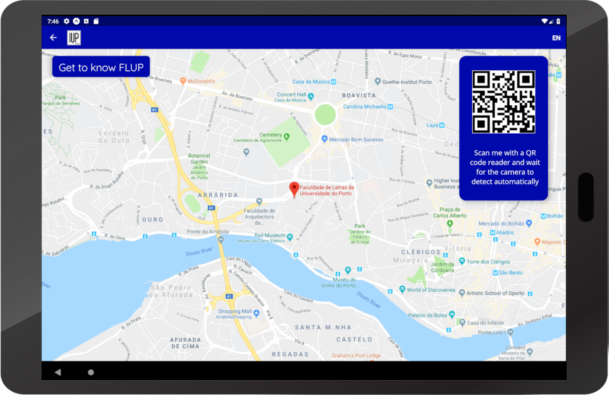
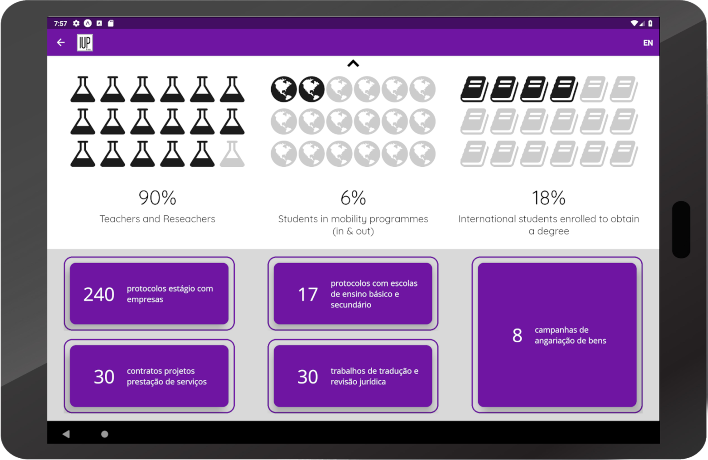
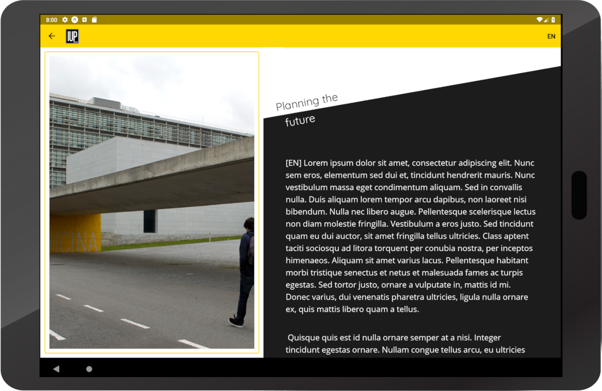
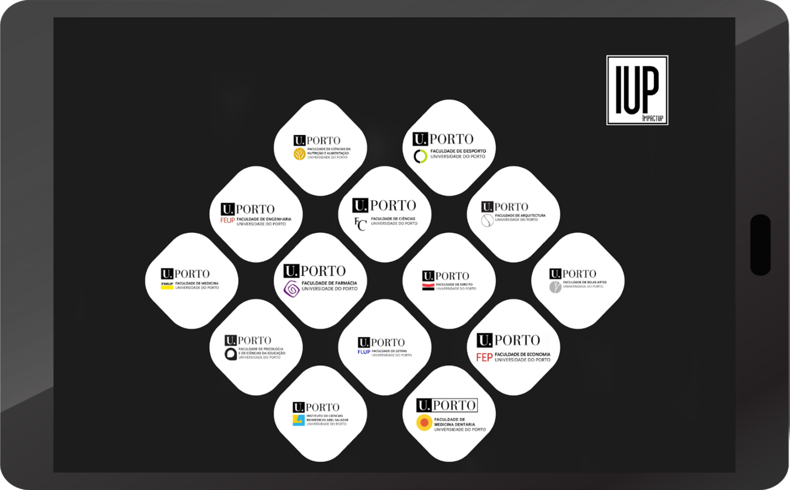

# ImpactUP


## Social Impact Exhibit - 14 Faculties

The goal of this project is to create a museum-like experience through an exhibit in U.Porto's rectory, which aims to present each one of the 14 faculties of the University.
A visitor to U.Porto's rectory can get to know each faculty, its projects and resulting impact in society, as well as future prospects on tomorrow's world by interacting with a tablet. Each faculty has its own user experience and visual aspect.

Although there are somewhat similar apps (_e.g._ [Study UK Exhibitions](https://play.google.com/store/apps/details?id=uk.education.education_exhibitions&_ga=2.81994832.730515720.1538341544-1603621910.1538341544)), where you can get to know a faculty and events it organises, these apps are not tailored for the social impact the faculties' projects have, and cannot be configured to our client's use case.


## Screenshots

| | | |
|:-:|:-:|:-:|
|  |  |  |
|  |  |  |


### Team - T3G1
-   André Miguel Ferreira da Cruz - __Scrum Master__
-   António Cunha Seco Fernandes de Almeida
-   Edgar Filipe Amorim Gomes Carneiro - __SPO__
-   João Dias Conde Azevedo
-   João Nuno Fonseca Seixas
-   João Paulo Madureira Damas
-   Luís Noites Martins
-   Mariana Lopes da Silva

## _Mobile App_ Development Environment Setup

On the `mobile` directory:

- Install dependencies: `yarn`
- Create a `.env`file with an `api` environment variable with your api's url
- Run expo `expo start`
- Wait for QR code to show up and scan with mobile phone using the [Expo](https://expo.io) app

### Running on a Emulator

If you prefer/need to run the app on an emulator, the easiest (and heaviest) way is to install one through [Android Studio](https://developer.android.com/studio/run/emulator). 

- Install Android Studio and [setup a virtual device](https://docs.expo.io/versions/latest/workflow/android-studio-emulator.html)
- Install a sample Expo project on your host machine (not on Docker). For example, ```create-react-native-app```
- Run the sample app on your emulator with ```npm run android```. This will install the Expo client on your fresh virtual device
- You should now be able to run any Expo app accessible by your virtual device by copying the app's url to the Search tab

### Running tests
On the `mobile` directory:

- Run test suites - `yarn test`
- Update snapshots - `yarn test -u`
- Watch mode (listen to file changes and rerun tests) - `yarn test --watch`


## _Web App_ Development Environment Setup
On the root directory, run docker:
```
REACT_APP_ENDPOINT=<api_url> docker-compose up --build web-app
```
* ```api_url``` could be the production API url -- http://impactup.westeurope.cloudapp.azure.com:80/api -- or any other endpoint of a running server.

### _Web App_ Running the Tests
Inside web-app folder, run this commands:
```
yarn install
yarn jest
```

## _Backend/Server_ Development Environment Setup
On the root directory, run docker:
```
docker-compose up --build server
```

### Running tests
On the `server` directory, run:
```
npm install
npm run test
npm run test:coverage
npm run test:coverage-report
```


## Deployment

**Note:** the following production and staging deployment urls are broken due to the limited resources available for the project, but are left here for historical reference.

#### Production

This environment is mapped to the repository's _master_ branch.
This environment uses the standard HTTP port: *80*

The result of the *production server* deployment can be observed at http://impactup.westeurope.cloudapp.azure.com:80/api

The result of the *production web-app* deployment can be observed at http://impactup.westeurope.cloudapp.azure.com:80/

The result of the *mobile app* deployment can be observed at https://expo.io/@ldsot3g1/impact-up?release-channel=master

#### Staging
This environment is mapped to the repository's _develop_ branch.
It's on the same _url_ as the production environment, but uses the *8080* port instead of the standard *80* port.

The result of the *staging server* deployment can be observed at http://impactup.westeurope.cloudapp.azure.com:8080/api

The result of the *staging web-app* deployment can be observed at http://impactup.westeurope.cloudapp.azure.com:8080/

The result of the *mobile app* deployment can be observed at https://expo.io/@ldsot3g1/impact-up?release-channel=develop
